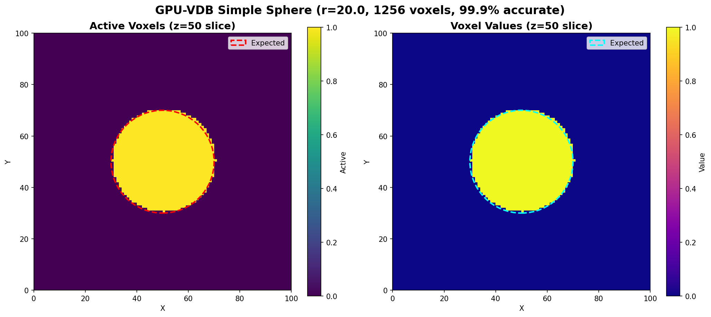

# Example 01: Simple Sphere

Single sphere visualization with accuracy validation.

## Output



## What It Does

- Creates a sphere at center (50, 50, 50) with radius 20
- Queries a 2D slice through the center
- Validates accuracy against analytical formula πr²
- Shows both active voxels and their values

## Results

- **Active voxels**: 1,256
- **Expected (πr²)**: 1,256.6
- **Accuracy**: 99.95% ✅

## Run

```bash
module load pytorch
python3 simple_sphere.py
```

