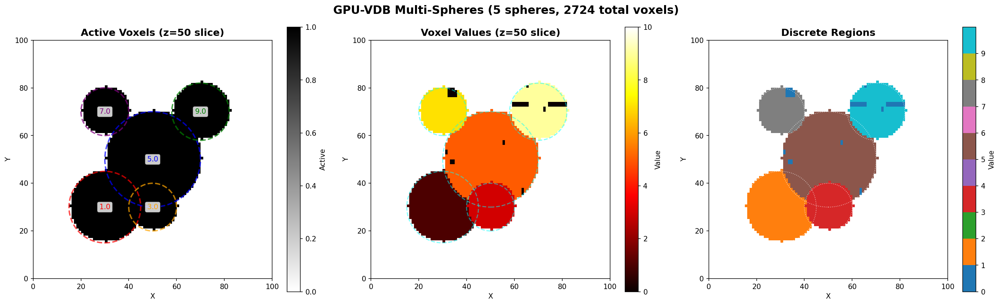

# Example 02: Multi Spheres

Multiple overlapping spheres with different values.

## Output



## What It Does

- Creates 5 spheres at different positions with different values
- Demonstrates concurrent voxel operations
- Shows value overwriting in overlapping regions
- Visualizes as binary mask, heat map, and discrete regions

## Results

- **Spheres**: 5 with varying sizes (r=10 to r=20)
- **Total voxels**: 2,724
- **Value range**: [0.0, 9.0]

## Run

```bash
module load pytorch
python3 multi_spheres.py
```

