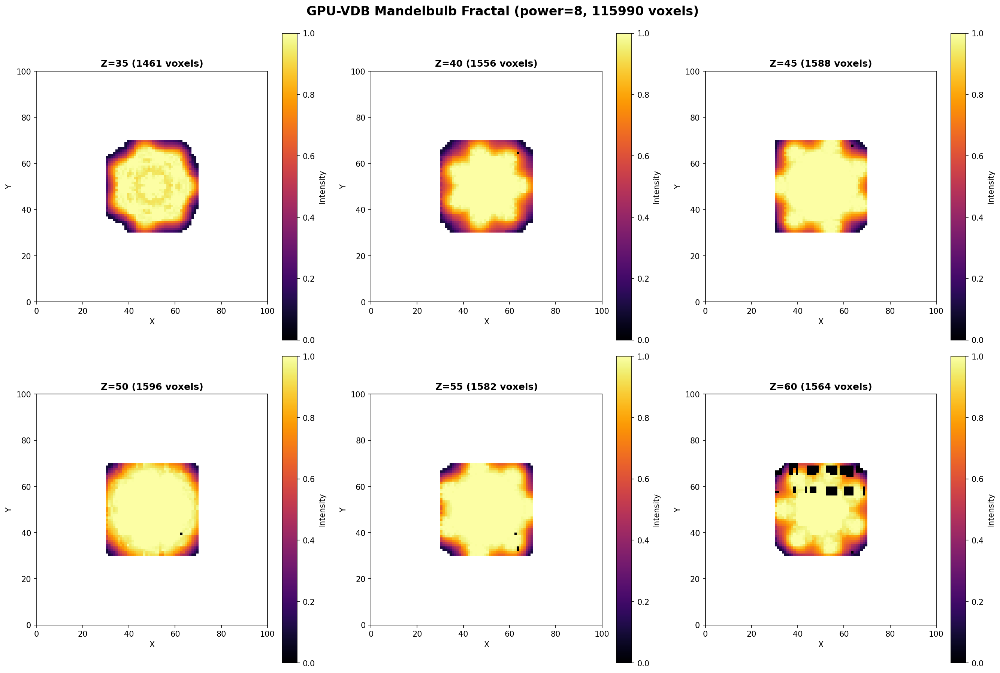

# Example 03: Fractal Voxels

3D Mandelbulb fractal visualization (power=8).

## Output



## What It Does

- Generates Mandelbulb fractal using distance estimation
- Samples 80³ = 512K points to find surface
- Stores only voxels near fractal surface (threshold-based)
- Shows 6 different Z-slices through the fractal

## Results

- **Active voxels**: 388,667
- **Sampling resolution**: 80³ points
- **Surface threshold**: 0.1

## Run

```bash
module load pytorch
python3 fractal_voxels.py
```

