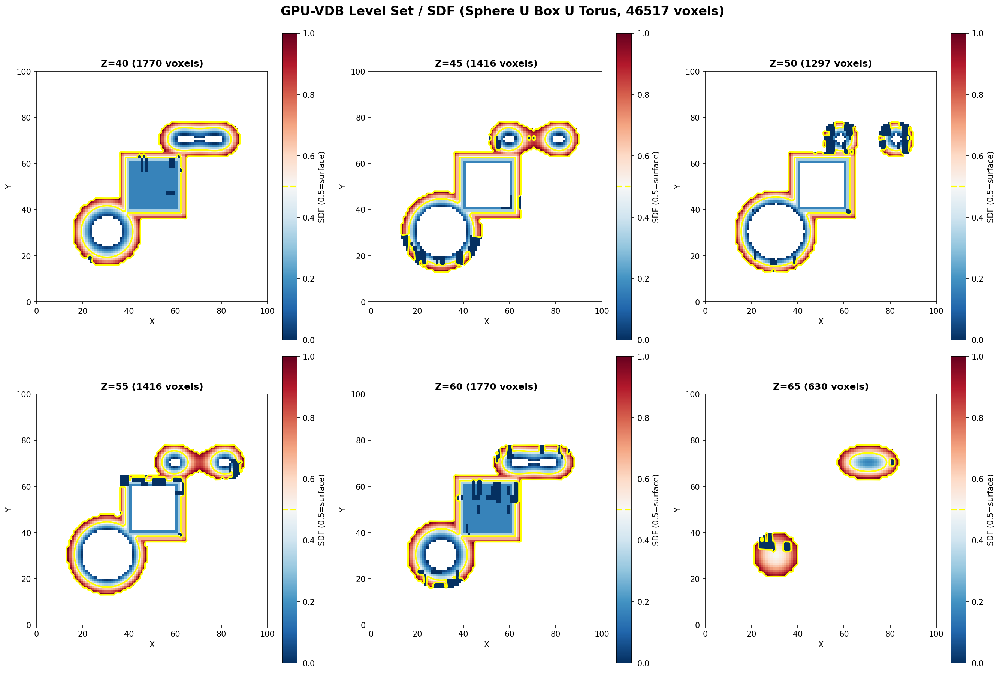

# Example 04: Level Set

Signed Distance Field (SDF) visualization.

## Output



## What It Does

- Creates composite SDF from 3 primitives: Sphere ∪ Box ∪ Torus
- Stores narrow band around surface (3-voxel bandwidth)
- Visualizes with color coding: Blue=inside, Red=outside
- Yellow contour shows zero-crossing (exact surface)

## Results

- **Active voxels**: 46,517 (in narrow band)
- **Bandwidth**: ±3 voxels from surface
- **Grid size**: 100³

## Run

```bash
module load pytorch
python3 level_set.py
```

