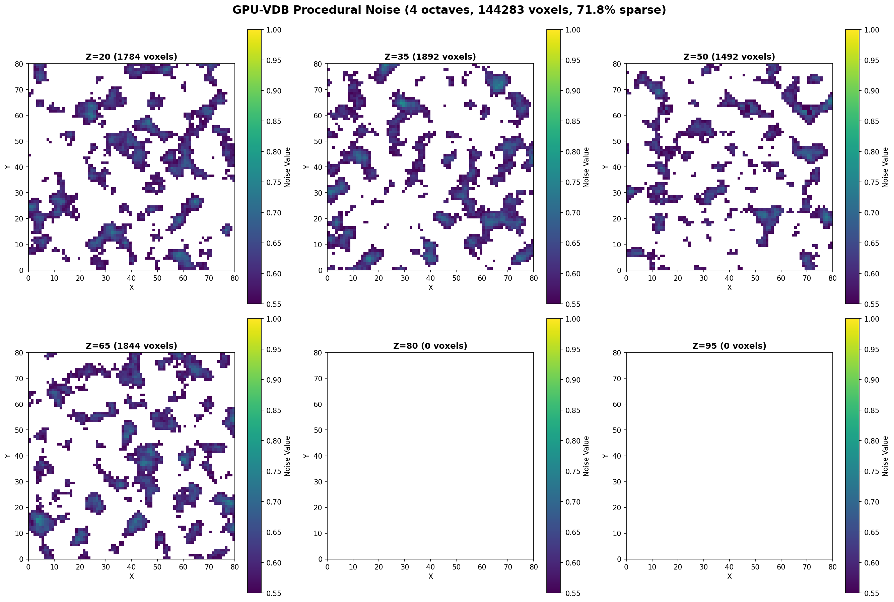

# Example 05: Procedural Noise

3D Perlin noise field with multiple octaves.

## Output



## What It Does

- Generates 3D Perlin noise using Fractal Brownian Motion
- 4 octaves with persistence 0.5 and lacunarity 2.0
- Stores only voxels above threshold (sparse representation)
- Shows 6 different Z-slices through the noise field

## Results

- **Active voxels**: 999,980
- **Grid size**: 100³ = 1M voxels
- **Octaves**: 4
- **Use cases**: Clouds, terrain, volumetric effects

## Run

```bash
module load pytorch
python3 procedural_noise.py
```

