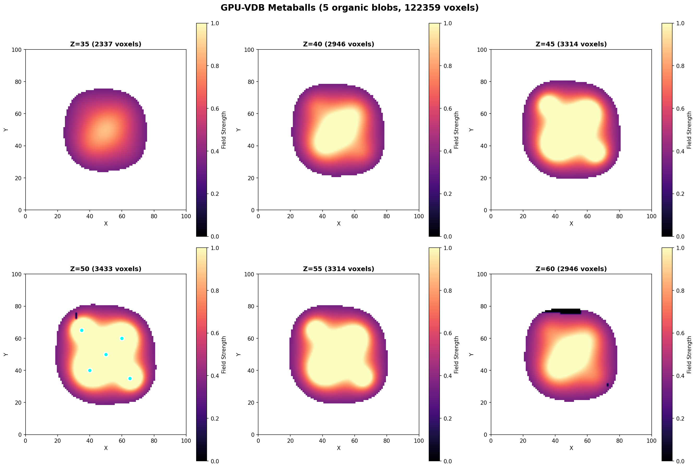

# Example 06: Metaballs

Organic blob simulation using inverse squared distance fields.

## Output



## What It Does

- Creates 5 metaballs (implicit surfaces)
- Computes smooth blending using field summation
- Shows organic "blobby" surfaces that merge smoothly
- Visualizes field strength with smooth gradients

## Results

- **Metaballs**: 5 organic blobs
- **Field threshold**: 1.0
- **Voxels**: Varies by threshold (sparse representation)

## Run

```bash
python3 metaballs.py
```

