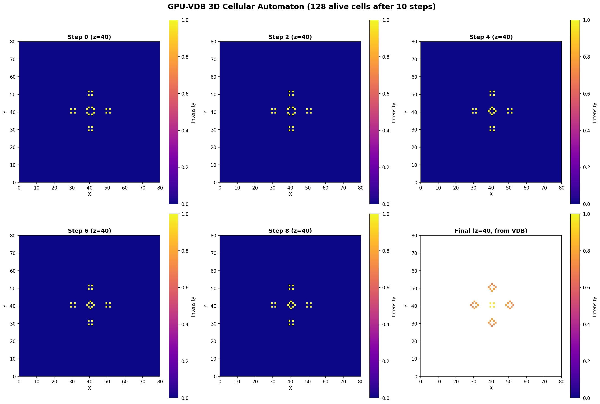

# Example 07: 3D Conway's Game of Life

3D cellular automaton simulation.

## Output



## What It Does

- Implements Conway's Game of Life in 3D
- Custom rules for 26-neighborhood (3D)
- Simulates 10 steps of evolution
- Shows alive/dead cell patterns over time

## Results

- **Initial pattern**: 3D glider-gun structure
- **Steps**: 10 simulation iterations
- **Rules**: Alive with 4-7 neighbors, birth with 5

## Run

```bash
python3 conway_3d.py
```

