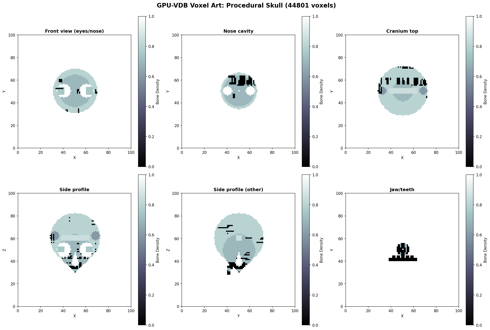

# Example 08: Voxel Art

Procedural skull generation with anatomical features.

## Output



## What It Does

- Generates a procedural skull structure
- Cranium, eye sockets, nose cavity
- Jaw with teeth, cheekbones
- Realistic anatomical proportions

## Results

- **Features**: Eyes, nose, teeth, bone structure
- **Style**: Medical/anatomical visualization
- **Colormap**: 'bone' for realistic appearance

## Run

```bash
python3 voxel_art.py
```

